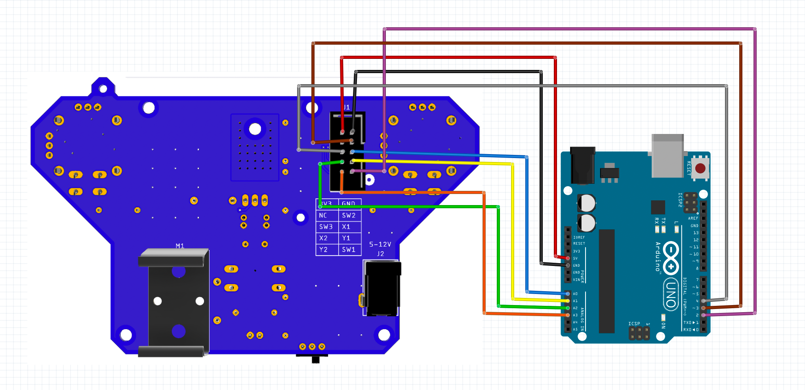
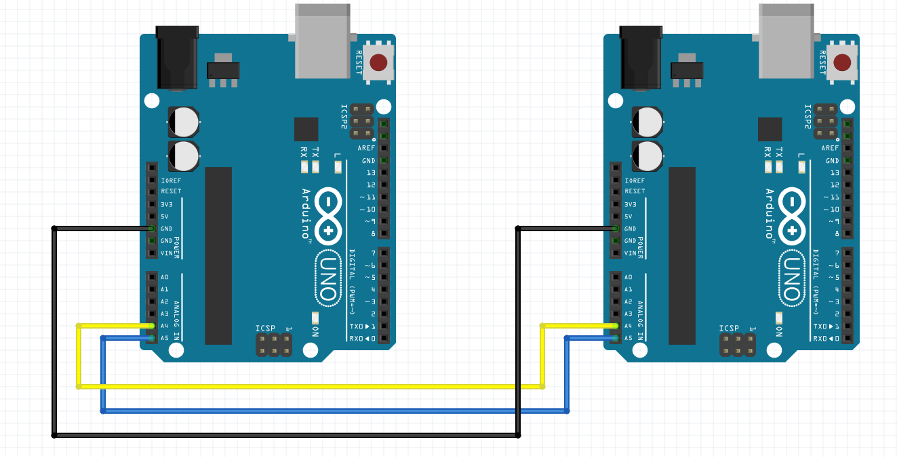

# Example for Arduino usage
## Usage

The example is intended to work with the Q-PCB-003 Four Motor board. Follow the instructions below to connect the Joystick to the Arduino.

The graphic below shows how two Arduinos get connected together via I2C.

