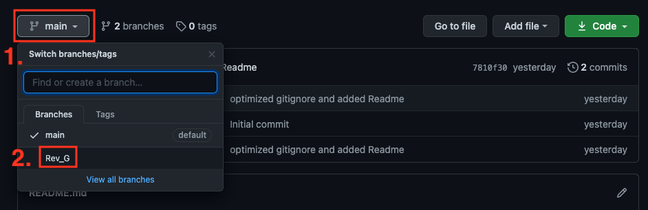
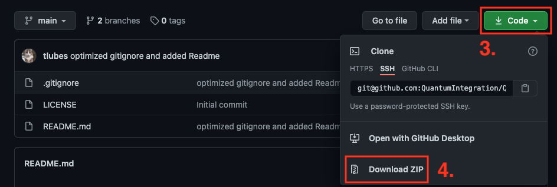

# Quantum DIY Kit Hardware Files
## Introduction

This repository contains all the hardware files necessary to build the PCBs and assemble the DIY kits. The PCBs can be ordered from for example [JLCPCB](https://jlcpcb.com/) or [PCBWay](https://www.pcbway.com/). The components can be sourced mostly from [Amazon](https://amazon.com/) or [Digikey](https://digikey.com/), according to the links in the BOM file.

## Download the correct revision

If you are nor familiar with the git version control system, please follow these simple steps to download your version of the DIY kit

<em>1. Click the branch button</em>

<em>2. Select the branch matching your revision</em>

<em>3. Click the Code button</em>

<em>4. Download the ZIP and extract it on your machine</em>
